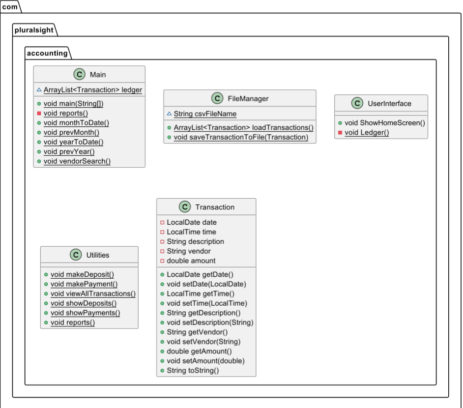

# Accounting Application 📊

## Table of Contents 📚
- [Overview 📝](#overview-)
- [Features ✨](#features-)
- [Class Structure 🏗️](#class-structure-)
    - [Main 🚀](#1-main-)
    - [FileManager 📁](#2-filemanager-)
    - [Transaction 💳](#3-transaction-)
    - [UserInterface 🖱️](#4-userinterface-)
    - [Utilities 🔧](#5-utilities-)
- [How to Run the Application ▶️](#how-to-run-the-application-)
- [Interesting Code](#interesting-code)

## Overview 
This project is an accounting application designed to help users manage financial transactions. It allows users to:
- Add deposits ➕
- Make payments ➖
- View a ledger of all transactions 
- Generate reports 📈

The application is built using Java and includes functionality for saving and loading transactions from a CSV file.

## Features ✨
1. **Transaction Management**
    - Add deposits and payments.
    - Save transactions to a file for persistent storage.
    - View all transactions, deposits, or payments.

2. **Reports** 📊
    - Generate reports such as:
        - Month-to-date 📅
        - Previous month 📆
        - Year-to-date 📅
        - Previous year 📆
        - Search by vendor 🔍

3. **File Management** 📂
    - Load transactions from a CSV file.
    - Save new transactions to the file.

4. **User Interface** 🖥️
    - Interactive command-line interface for navigating the application.

## Class Structure 🏗️
### 1. `Main` 🚀
The entry point of the application, responsible for initializing the ledger and launching the user interface.

### 2. `FileManager` 📁
Handles reading from and writing to the CSV file that stores transaction data.

### 3. `Transaction` 💳
Represents a financial transaction with details such as:
- Date 📅
- Time ⏰
- Description 📝
- Vendor 🏢
- Amount 💲

### 4. `UserInterface` 🖱️
Manages the user interactions through a menu-driven command-line interface.

### 5. `Utilities` 🔧
Provides helper methods for transaction-related operations, such as:
- Making deposits ➕
- Making payments ➖
- Viewing transactions 📒
- Generating reports 📈

## How to Run the Application ▶️
1. Clone the repository to your local machine.
2. Open the project in your preferred Java IDE.
3. Ensure that the `transaction.csv` file is present in the `src/main/resources` directory.
4. Run the `Main` class to start the application.

## Interesting code

The switch statement checks the user's choice and performs different actions based on what the user selected:

###### Screens

